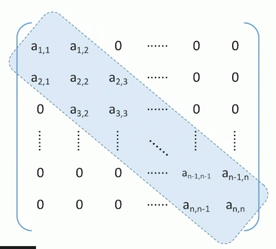

# 数组

[TOC]

## 特殊矩阵

### 方阵

#### 对称矩阵

若n阶**方阵**中任意一个元素a~i,j~都有a~i,j~=a~j,i~，则该矩阵为**对称矩阵**

普通存储：n*n 二维数组

压缩存储策略：

- 只存储主对角线+下三角区

  ​	按**行优先**原则将各元素存入一维数组中。

  	

- 只存储主对角线+上三角区

思考：（压缩存储）

1. 数组大小应该为多少？

   ​	(1+n)*n/2

2. 站在程序员的角度，对称矩阵压缩存储后怎样才能方便使用？

   ​	可以实现一个“映射”函数，使矩阵下标→数组下标

#### 上（下）三角矩阵

压缩存储策略：按照**行优先**原则将橙色区元素存入一维数组中。并在最后一个位置存储常量c。共需要n*(n+1)/2+1个元素位置

#### 对角矩阵（带状矩阵）

> 当|i-j|>1时，有a~i,j~=0（1<=i, j<=n）

压缩存储策略：

按行优先（或列优先）原则，只存储带状部分。需要3n-2个元素大小。元素a~i,j~位置=2i+j-3

### 稀疏矩阵

> 非零元素远远少于矩阵元素的个数

压缩存储策略：

- 顺序存储：
  - 三元组<行，列，值>（注：此处行、列标从1开始）
  - 
- 链式存储：
  - 十字链表法
  - 
  - 
  - 

## 一维数组

## 多维数组

