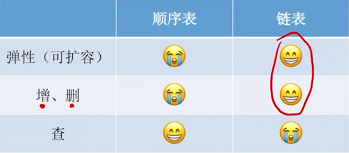

# 线性表

## 比较

### 问题

- 请描述顺序表和链表的bla bla bla …实现线性表时，用顺序表还是链表好？（6分）

  > 顺序表和链表的 **逻辑结构** 都是线性结构，都属于线性表
  >
  > 但是二者的 **存储结构** 不同：顺序表采用顺序存储…(特点，带来的优点缺点)；链表采用链式存储…(特点，导致的优缺点)
  >
  > 由于采用不同的存储方式实现，因此 **基本操作** 的实现效率也不同：当 <u>初始化</u> 时…；当 <u>插入</u> 一个数据元素时…；当 <u>删除</u> 一个数据元素时…；当 <u>查找</u> 一个数据元素时…。
  >
  > 

### 适用场景

- `链表`：适合表长<u>难以预估</u>、经常要<u>增加/删除</u>元素
- `顺序表`：适合表长<u>可预估</u>、<u>查询（搜索）</u>操作较多

### 三要素

#### 逻辑结构

>  都属于线性表，都是线性结构

#### 物理结构/存储结构

- `顺序表`（顺序存储）：
  - 优点：
    1. 支持随机存取
    2. 存储密度高
  - 缺点：
    1. 大片连续空间分配不方便
    2. 改变容量不方便
  - 其它：
    - 静态分配：静态数组：数据系统回收
    - 动态分配：动态数组：需要手动malloc/free或new/delete

- `链表`（链式存储）：
  - 优点：
    1. 离散的小空间分配方便
    2. 改变容量方便
  - 缺点：
    1. 不可随机存取
    2. 存储密度低

#### 基本操作

##### 创建

> 链表灵活性更高

- `顺序表`（顺序存储）：

  - 需要预分配大片连续空间。

  - 若分配空间过小，则之后不方便拓展容量；

    若分配空间过大，则浪费内存资源。

  - 静态：容量不可改变；

    动态：容量可改变，但需要移动大量元素，时间代价高

- `链表`（链式存储）：
  - 只需要分配一个头结点（也可以不要头结点，之声明一个头指针），之后方便拓展

##### 销毁（考的不多）

> 静态顺序表 > 动态顺序表 ≈ 链表

- `顺序表`：修改L->length=0

  - 静态：系统自动回收空间；

  - 动态：需要手动free或delete堆区的内存空间

- `链表`：依次删除各个结点(free)

##### 增、删

> 遍历元素一般情况下要比移动元素要快，因此链表相对较好

- `顺序表`：
  - 插入/删除元素要将后续元素都后移/前移
  - 时间复杂度O(n)，时间开销主要来自于<u>移动元素（拷贝数据）</u>(**若数据元素很大，则移动的时间代价很高**)

- `链表`：
  - 插入/删除元素秩序修改指针即可
  - 时间复杂度O(n)，时间开销主要来自于<u>查找目标元素（遍历）</u>（**查找元素的代价更低**）

##### 改（考的不多）

##### 查

> 顺序表 > 链表
>
> 顺序表可以使用二分查找等方法，且可以直接定位数据。
>
> 链表无论如何都要遍历结点。

- `顺序表`：
  - 按位查找：O(1)（数组下标）
  - 按值查找：
    - 若表内元素无序，可在O(n)时间内找到（遍历）
    - 若表内元素有序，可在O(log~2~n)时间内找到（二分法）

- `链表`：
  - 按位查找：O(n)（遍历）
  - 按值查找：O(n)（遍历）

## 顺序表

### 静态顺序表

### 动态顺序表

## 链表

### 单向链表

### 双向链表

### 静态链表

### 循环链表

#### 循环单链表

#### 循环双链表

