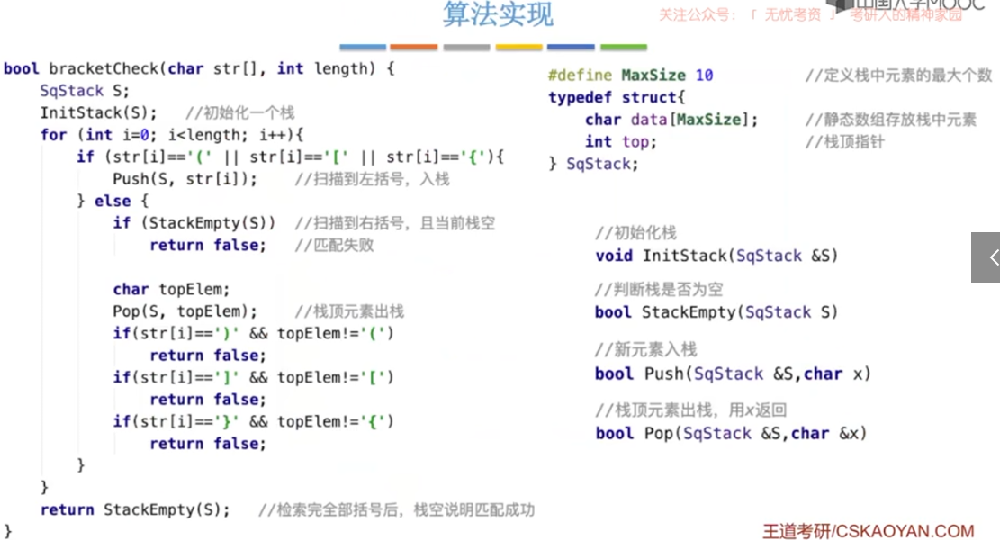
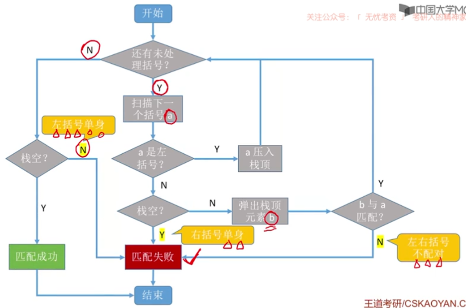
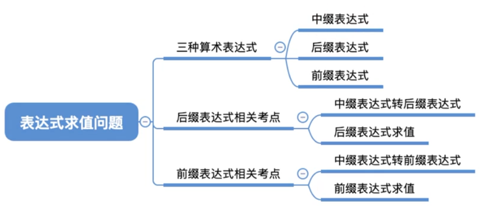
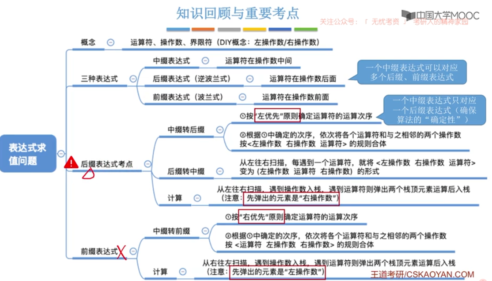
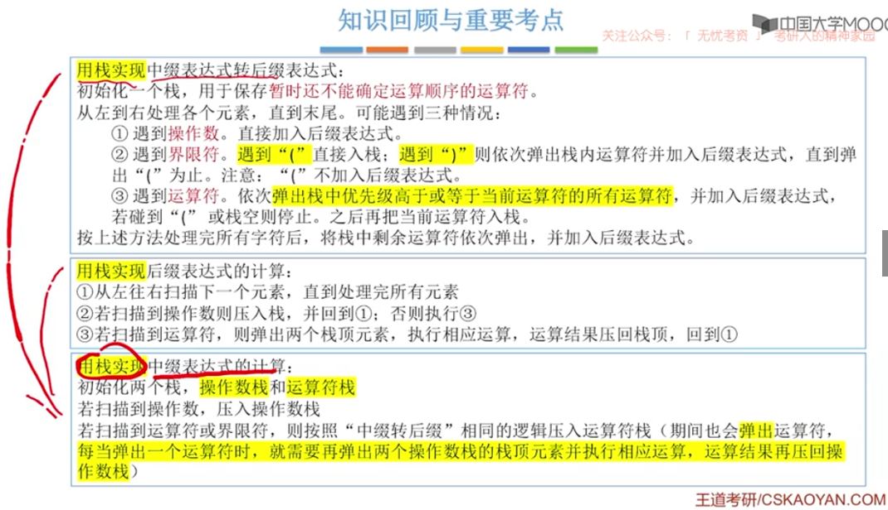

# 栈

[TOC]

## 比较

## 应用

### 括号匹配

#### 思想

依次扫描所有字符，遇到左括号入栈，遇到右括号则弹出栈顶元素检查是否匹配。

**匹配失败情况**：

1. 左括号单身
2. 右括号单身
3. 左右括号不匹配

#### 算法

#### 流程

### 表达式求值

> 常考后缀表达式的应用，大题和选择

#### 概念

- 操作数：1234567890
- 运算符：+-*/
- 界限符：（） 反应计算顺序
- 前缀表达式：【运算符 左操作数 右操作数】，左优先原则。也叫波兰表达式（Polish notation）。不用界限符也能无歧义运算
- 后缀表达式：【左操作数 右操作数 运算符】，右优先原则。也叫逆波兰表达式（Reverse Polish notation）。不用界限符也能无歧义运算

#### 思想

- 中缀表达式求值

  > 用栈实现中缀表达式的机算：
  >
  > 初始化两个栈，**操作数栈**和**运算符栈**
  >
  > 若扫描到**操作数**，压入操作数栈
  >
  > 若扫描到**运算符**或**界限符**，则按照“中缀转后缀”相同的逻辑压入运算符栈（期间也会**弹出**运算符，**每当弹出一个运算符时，就需要再弹出两个操作数栈的栈顶元素并执行相应运算，运算结果再压回操作数栈**）

- **前缀表达式求值**（手算）

  **从右往左**扫描，每遇到一个运算符，就让运算符前面最近的两个操作数执行对应运算，合体为一个操作数

- **前缀表达式求值**（机算）

  1. **从右往左**扫描下一个元素，直到处理完所有元素
  2. 若扫描到操作数则压入栈，并回到（1） ；否则执行（3）
  3. 若扫描到运算符，则弹出两个栈顶元素（**先左后右**），执行相应运算，运算结果压回栈顶，回到（1）

- **中缀转前缀**（手算）

  1. 确定中缀表达式中**各个运算符的运算顺序**
  2. 选择下一个运算符，按照**【运算符  左操作数  右操作数】**的方式组合成一个新的操作数
  3. 如果还有运算符没被处理，就继续（2）

  - **“右优先”原则**：只要**右**边的运算符能先计算，就优先算**右**边的

- **中缀转前缀**（机算）

- **后缀表达式求值**（手算）

  **从左往右**扫描，每遇到一个运算符，就让运算符前面最近的两个操作数执行对应运算，合体为一个操作数
  注意：两个操作数的左右顺序

- **后缀表达式求值**（机算）

  1. **从左往右**扫描下一个元素，直到处理完所有元素
  2. 若扫描到操作数则压入栈，并回到（1） ；否则执行（3）
  3. 若扫描到运算符，则弹出两个栈顶元素（**先右后左**），执行相应运算，运算结果压回栈顶，回到（1）

- **中缀转后缀**（手算）

  1. 确定中缀表达式中**各个运算符的运算顺序**
  2. 选择下一个运算符，按照**【左操作数  右操作数  运算符】**的方式组合成一个新的操作数
  3. 如果还有运算符没被处理，就继续（2）

  - **“左优先”原则**：只要**左**边的运算符能先计算，就优先算**左**边的

- **中缀转后缀**（机算）

  - 初始化一个栈，用于保存暂时还不能确定运算顺序的运算符

  1. 遇到**操作数**。直接加入后缀表达式
  2. 遇到**界限符**。遇到“（”直接入栈；遇到“）”则依次弹出栈内运算符并加入后缀表达式，直到弹出“（”为止。注意：“（”不加入后缀表达式。
  3. 遇到**运算符**。依次弹出栈中优先级高于或等于当前运算符的所有运算符，并加入后缀表达式，若碰到“（”或栈空则停止。之后再把当前运算符入栈。

  - 按照上述方法处理完所有字符后，将栈中剩余运算符依次弹出，并加入后缀表达式。
  - **“左优先”原则**：只要左边的运算符能先计算，就优先算左边的

#### 算法

#### 流程

#### 类型

### 递归

#### 思想

函数调用的特点最后被调用的函数最先执行结束（LIFO后进先出）

函数调用时，需要一个栈存储：

1. 调用返回地址
2. 实参
3. 局部变量

递归调用时，函数调用栈可称为“递归工作栈”。

每进入一层递归，就将递归调用所需信息压入栈顶；每退出一层递归，就从栈顶弹出相应信息。

**缺点：**效率低，太多曾递归可能会导致栈溢出；可能会包含很多重复计算。解决办法：可以自定义栈将递归算法改造成非递归算法。

## 顺序栈

## 共享栈

## 链栈